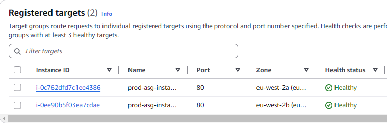
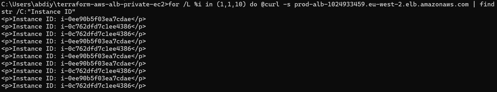
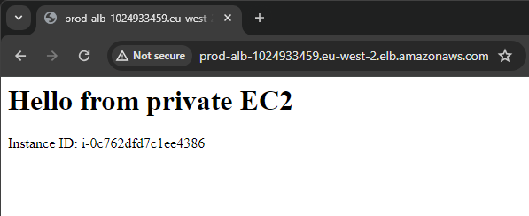
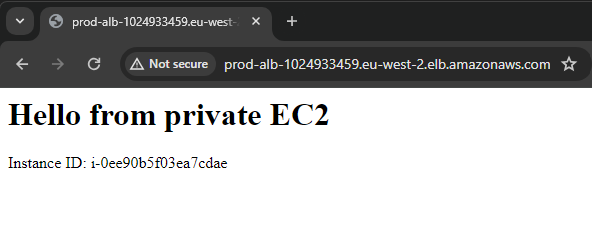

# terraform-aws-alb-private-ec2

Production-style AWS infrastructure deployed using **Terraform**.

This project provisions a highly available web application architecture using an **Application Load Balancer**, **Auto Scaling Group**, and **private EC2 instances**, following real-world cloud engineering patterns.

---

## Architecture Overview

Infrastructure deployed across **multiple Availability Zones**:

- Custom VPC
- Public and Private Subnets (Multi-AZ)
- Internet Gateway
- NAT Gateway for private outbound access
- Application Load Balancer (public entry point)
- Auto Scaling Group of private EC2 instances
- NGINX installed via user-data
- EC2 access via **AWS Systems Manager (SSM)** — no SSH required
- Terraform Remote State using **S3 + DynamoDB locking**

### Traffic Flow
```
Internet → ALB → Private EC2 Instances (ASG) → NAT Gateway → Internet
```

---

## Repository Structure
```
terraform-aws-alb-private-ec2/
│
├── backend/                # Remote state bootstrap
├── modules/
│   ├── vpc/                # Networking layer
│   ├── alb/                # Load balancing layer
│   └── compute/            # EC2 + ASG + IAM
│
├── screenshots/            # Deployment validation
├── main.tf                 # Module orchestration
├── variables.tf
├── providers.tf
├── backend.tf
└── outputs.tf
```

---

## Key Engineering Concepts Demonstrated

- Infrastructure as Code (Terraform)
- Modular Terraform architecture
- Multi-AZ high availability design
- Private compute architecture
- Load balancing validation
- Auto Scaling behaviour
- Remote Terraform state management
- State-safe refactoring using modules
- Operational troubleshooting and recovery

---

## Prerequisites

- Terraform **>= 1.5**
- AWS CLI configured
- IAM permissions for:
  - VPC
  - EC2
  - ELBv2
  - IAM
  - S3
  - DynamoDB

> ⚠️ **Cost Notice**
>
> This deployment creates an **ALB** and **NAT Gateway**, which incur charges while running.  
> Destroy resources after validation.

---

## Deployment

### 1. Bootstrap Remote State
```bash
cd backend
terraform init
terraform apply
```

Creates:
- S3 state bucket
- DynamoDB state lock table

### 2. Deploy Infrastructure
```bash
cd ..
terraform init
terraform plan
terraform apply
```

### Destroy Infrastructure
```bash
terraform destroy
```

---

## Validation

Load balancing was verified by returning backend instance metadata.

Example validation command:
```bash
for /L %i in (1,1,10) do @curl -s http://<ALB_DNS_NAME>/ | findstr "Instance ID"
```

Output confirms traffic distribution across instances.

---

## Troubleshooting Scenarios Simulated

- ALB 503 Service Unavailable
- Failed health checks
- Target draining behaviour
- Instance replacement via Auto Scaling
- Browser session stickiness vs real load distribution

---

## Deployment Evidence






---

## Learning Outcomes

This project demonstrates the transition from:

> Manual AWS provisioning → Production-style Infrastructure as Code

Including modular design, remote state management, and operational troubleshooting.

---

## Author

Yoonis Abdi  
Network Analyst → Cloud / DevOps Engineer